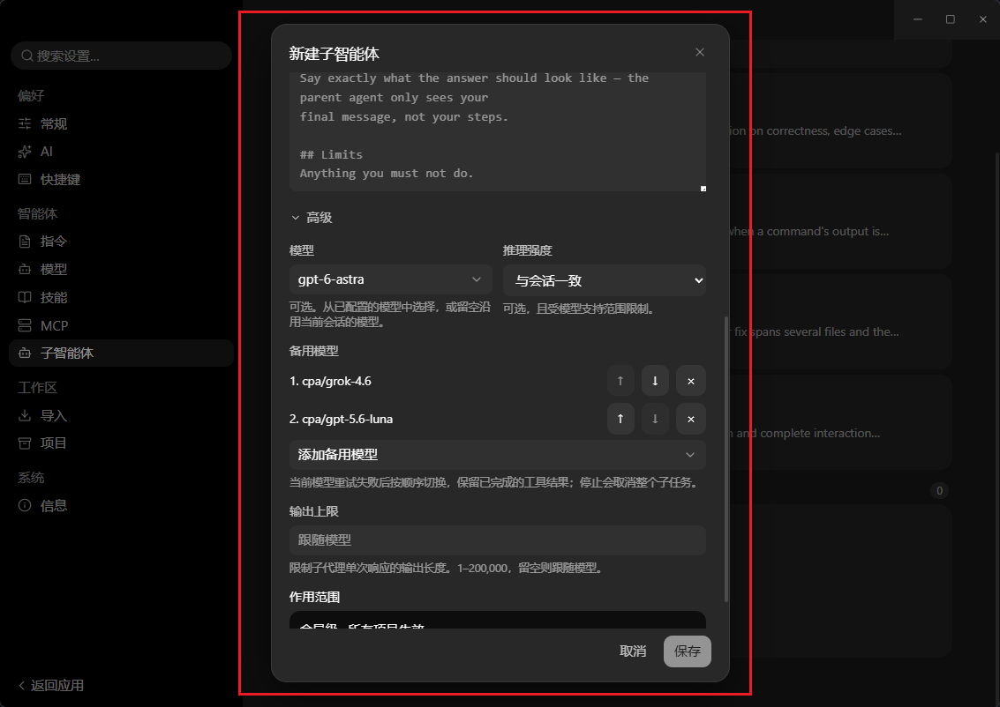

# ADR: Ordered subagent model fallback

- Status: Accepted for implementation
- Date: 2026-09-14
- Related: ADR 0062, ADR 0063, ADR 0202, ADR subagent-model-opt-in

## Context

A subagent can select only one model. Its existing bounded provider retries
cannot recover when that model remains unavailable. Restarting the delegated
task on another agent could repeat tools that already changed files.

## Decision

Add optional `fallbackModels` to a definition, the user-subagent record/input,
and the existing internal launch definition. It is an ordered list of
`provider/model` strings in managed Markdown and host RPC, parsed into model
pins in Shared. The existing primary `model` and Task override priority stay
unchanged. Missing lists preserve single-model behavior. An omitted update
preserves the list; `[]` clears it. No database or protocol version changes are
needed for these additive fields; old documents remain valid.

Electron resolves alternatives through the same credential, provider-count,
and model-capability boundaries as primary pins. These bindings are scoped to
their owning definition, even when Task explicitly overrides its primary.
They do not grant `Task.model` access to another definition, or enter the
opted-in model summary. A primary pin that cannot resolve still fails before
launch; an unresolved alternative is reported when reached and skipped.

After the current model's existing retries are exhausted (or a provider error
is non-retryable), the runtime tries the next configured alternative. Each
resolved provider-id/model-id pair is tried at most once per delegation,
excluding the existing retry budget within each model. The same Agent keeps
its system prompt, original task, successful assistant/tool history, tool
scope, counters, and usage. Only the failed assistant request is removed from
model context before `continue()`. It is retained in the visible transcript.
No task or completed tool is replayed by the fallback controller.

The model, adapter, credentials, headers, output cap, and thinking level change
together. Thinking is re-clamped from the definition or original parent
selection for each model; `omit` remains omission. The original abort signal
owns the whole chain. Host/tool failures, missing reports, unexpected thrown
errors, and cancellation do not initiate fallback.

Failed attempts remain visible in child transcript diagnostics and in the
bounded parent report. Lifecycle snapshots retain the final effective model,
thinking, and additive `modelFailures` diagnostics. Exhausting the chain
returns `failed` with the final provider error; it never selects an unlisted
model or silently inherits the parent as recovery.

## Settings example

The Advanced section keeps one primary model and lists fallback models in
priority order. Each fallback can be moved up/down or removed.

## Validation

Shared parser and provider-resolution tests, host registry round trips,
real local HTTP tests for continuation/credentials/cancellation, and the
sidecar model suite cover the contract. Required integration suites are
`test:e2e`, `test:e2e:subagents`, and `test:e2e:subagent-models`.
The editor journey separately covers adding, reordering, removing, and
retaining unavailable pins across save/reopen.

### Local verification and remaining integration gates

- Runtime: 200 focused tests passed, including the existing parent-runtime
  suite; Shared: 35 definition tests; Desktop: 100 subagent tests; i18n: 24
  tests; host-core: 13 subagent tests. Typecheck, lint, Rust formatting and
  clippy passed.
- `test:e2e:subagent-models`: passed on the request branch with a real sidecar
  and local HTTP transport, including ordered fallback and live/settled model
  metadata. This is pre-integration evidence.
- `test:e2e`: 19 passed, two project-deletion assertions failed, and two live
  provider scenarios were skipped for missing credentials. An independently
  built, unchanged `a9053531` host reproduced the same two failures.
- E2E: **NOT RUN** to completion for `test:e2e:subagents` on Windows. Rust's
  known-folder lookup ignores the fixture HOME, so the suite now fails before
  registry writes. Alternative validation is the host record/document tests
  and Shared/launch-loader tests. The remaining risk is the complete managed
  registry RPC/save/reopen journey; run this suite under Linux/macOS isolation.
- Full editor interaction/reload and post-integration `main` E2E remain
  outstanding. This request retains its branch and worktree for integration.

### WSL branch verification (2026-09-14)

The implementation commit `82dfb3353ab071b4b0479ac401797cc6ab3c178f`
was exported to an isolated Linux filesystem directory and built under WSL2
Ubuntu 24.04, using Linux Node 24.14.1, pnpm 11.18.0, Rust 1.96.0, and
Electron 43.6.0. No Windows `node_modules` or executable binaries were reused.
The locked dependency install, JavaScript build, and Linux host build passed.

- `pnpm test:e2e:subagents`: **31/31 passed**, including ordered fallback
  persistence, omitted-update preservation, invalid-pin rejection, loader
  propagation, and clearing the list.
- `pnpm test:e2e:subagent-models`: **13/13 passed**, including fallback and
  the existing model opt-in/override isolation scenarios.
- `pnpm test:e2e`: **21/21 non-live checks passed**. The two real-provider
  cases (`E2E-008-live-model`, `E2E-009-stream`) were **SKIPPED** because no
  test API key was configured. Both project-deletion cases that failed on
  Windows passed on Linux; this does not fix or invalidate the Windows results.
- An isolated Electron/Xvfb configuration-editor check using CDP passed four
  journeys: add/reorder/save, preserve across another-field edit and renderer
  reload, retain unavailable-provider pins, and remove all/save/reopen. The
  UI exercised the real renderer, preload, Main, and Linux host registry;
  persisted records were checked through IPC. It used synthetic providers
  without credentials and removed its temporary HOME/data/profile afterward.

The test environment set
`PI_DESKTOP_PLUGIN_MARKET_URL=http://127.0.0.1:9/e2e-offline-catalog` so
startup used the existing bundled marketplace catalog. With the default
external market URL, WSL network connectivity caused host-handshake timeouts
before the tested behavior. These runs do not qualify online marketplace
connectivity. The UI run also logged an unrelated bundled `pi.file-manager`
module-load error; its successful subagent assertions are not a full plugin
health claim.

This closes the earlier Linux registry and configuration-editor validation
gaps. Full task-transcript reload acceptance after fallback, real-provider
cases, and required post-integration `main` E2E remain outstanding. No main
integration or remote publication was performed during this validation.

### Expanded failure-chain verification (2026-09-14)

The existing implementation at `82dfb335` was unchanged. Additional test
sources were copied into the isolated WSL source snapshot; these results
apply to that implementation with the expanded tests in this change.

| Local provider responses in configured order | Expected and observed result |
| --- | --- |
| Success, unused alternative | Primary completes; no alternative request |
| HTTP 404, success, unused alternative | Second model completes |
| HTTP 404, HTTP 404, success, unused alternative | Third model completes |
| HTTP 404, HTTP 404, HTTP 404, success, unused alternative | Fourth model completes |
| Four HTTP 404 responses | Child fails after four requests; no wraparound |

Both the real-transport runtime tests and the separate sidecar process passed
this matrix. The sidecar assertions inspect actual request order, the original
task, every live model change, the settled model/status, ordered failure codes,
and the final child report. A successful parent response alone cannot pass the
child-failure assertion.

Additional real-transport tests passed for mixed HTTP 401/403/404 failures,
HTTP 429 and HTTP 503 exhausting independent retry budgets on two consecutive
models, and preserving one completed tool call across one, two, or three
failed models. The retry fixture sends `Retry-After: 0`; production retry
logic and retry counts remain active, with no fake timers or retry bypass.
Cancellation, unresolved/duplicate bindings, credentials, thinking selection,
and host-tool error boundaries remain covered.

- Windows: `pnpm --filter @pi-desktop/agent-runtime exec vitest run
  src/subagent.test.ts src/subagent-fallback.test.ts
  src/subagent-definitions.test.ts src/runtime.test.ts` — **210/210 passed**.
- Windows: `pnpm --filter @pi-desktop/agent-runtime typecheck` — **passed**.
- Windows: `pnpm lint` and `git diff --check` — **passed**.
- WSL: `pnpm --filter @pi-desktop/agent-runtime exec vitest run
  src/subagent-fallback.test.ts --reporter=verbose` — **17/17 passed**.
- WSL: `pnpm test:e2e:subagent-models` — **17/17 checks passed**, including
  five failure-chain/control scenarios and the existing model-isolation checks.

These are deterministic local HTTP providers driving the real runtime and
sidecar, not live commercial-model availability tests. No application code
changed, so the previously built portable executable contains the same tested
fallback implementation. Main integration, post-integration E2E, live-provider
coverage, and task-transcript reload acceptance remain outside this result.
